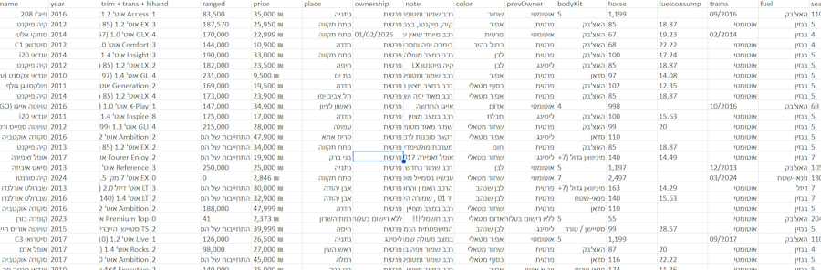
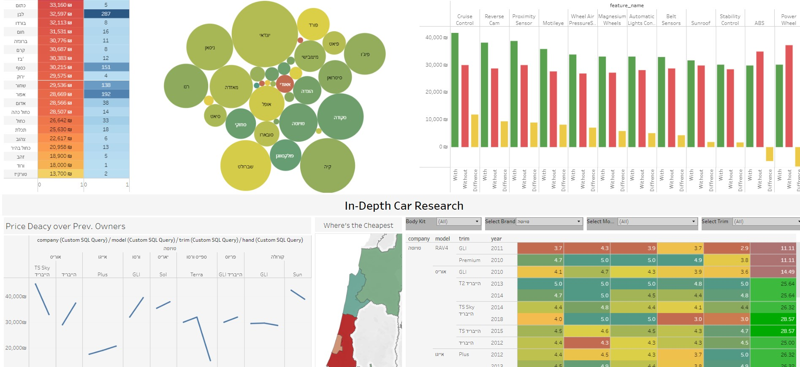

# Used Car Market Study- [Project Link](https://public.tableau.com/app/profile/yam.yam/viz/UsedCarsBuyingGuide/Dashboard2)

This is a document for a personal project of mine, recording my effort to help my family and I find a new car.

## 1) Specification and needs - Planning Phase
We've outlayed in simple words our desires:
* Would cost 45-50k ILS max
* Good fuel economy
* Automatic transmission
* A reloaible car brand and model that will requie minimal maintanane
* our aspirations from a car:
    - Travel from A to B without public transport (at the very least to Tel-aviv and back)
    - Off-road & 4x4 driving caplibity for leasure
    - Carrying capacity for heavier-industrial loads
    - Carry at least 4 passsagnes in comfort
  
### What the questions im trying to answer?
* What are the total average stats of the current market?
* What is the effect of other, non-standard factors on price and by how much?
* How price deacy over previous ownerships?
* what is the most common and brand or car models in the market?
* Which region is the cheapest to buy at?
* How do specific models are in comparison to others in terms fo fuel economy, value, comfort and safety?
* I've seen that many liting include "special" features, what's their effect on price and should i bother buying a car with such things?
* Price trend over kilometrage (is there an optimal time to buy an older car?)
* is there an more optimal specs that give a favourble insurance rather than just buying the smallerst car possible?
* creative exploration:
  - corrarlation between price and: house power, engine size, owner, wheel-drive

### The data i'll be needing
* scraped 1200 car listing off Yad2
* selected to following filters:
    - vehicle type: קרוסאובר, ג׳יפ, רכב משפחתי, רכב מיני, מיניוואן, טנדר
    - Max price: 48000 ILS
    - Year of manufaccure: 2010 at the earliest
    - location: צפון, מרכז, השרון, חדרה
* Car price
* Fuel consumption rate
* Ownership #
* Car name and model, brand and sub-model
* where its sold
* engine size
* num of seats
* present features
* user ratings and their sub-cat ratings

## 2) Colletion Phase

1. I've headed to the one of the biggest online used car martket places, Yad2
2. Using WebScrapper.io start to outlay the data value and structures i want to extract
3. I've marked around 1400 lisitngs over the last 30 pages on that day (28/5)
4. Ran the scripts and got a table running 37k raw data points

## 3) Processing Phase

### Cleaning in Google sheets

#### Goal: to convert all raw imported data to be analyis-ready and upload it to an SQL server
#### Challages: many of the coulmn are     
* wrong data type
* free text uncategorized values
* serveral cloumns that are cloumped into one

### Upload to SQL server

1) After the data has been cleaned in google sheets i have exported it as CSV files and uploaded them to a client SSMS
2) Hooked up the primary keys of the sub-tables to the main one
3) Then started to execut various queries to uncover insights within the data

## 4) Conclusion and Sharing Phase

1) i connceted my SQL server to my Tableau client and got easy and fast access to my database, which i also update as i wish.
2) after applying the various tables ive created from my target queries i created a vialuzions and the graph of my dashboard
* present the effect of the car's color and accessories on the price.
* the ability to make a drill-down anaylsis of spesici car trim and see its suqcequent rating and, cheapest region to buy it in, and its price decay over ownerships, for optimal market apparoach and saving money.

    

