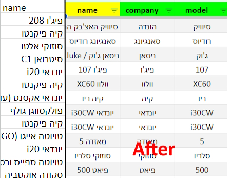
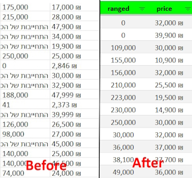
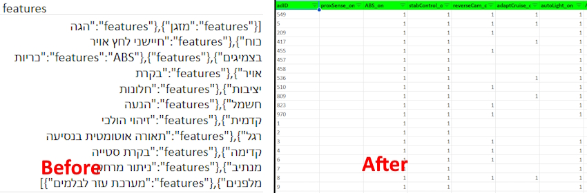

# Used Car Market Study- [Project Link](https://public.tableau.com/app/profile/yam.yam/viz/UsedCarsBuyingGuide/Dashboard2)

This is a document for a personal project of mine, recording my effort to help my family and I find a new car.

## 1) Specification and needs - Planning Phase
We've outlayed in simple words our desires:
* Would cost 45-50k ILS max
* Good fuel economy
* Automatic transmission
* A reliable car brand and model that will require minimal maintenance
* Our aspirations from a car:
    - Travel from A to B without public transport (at the very least to Tel-aviv and back)
    - Off-road & 4x4 driving capability for leisure
    - Carrying capacity for heavier-industrial loads
    - Carry at least 4 passengers in comfort
  
### What are the questions I'm trying to answer?
* What are the total average stats of the current market?
* What is the effect of other, non-standard factors on price and by how much?
* How does the price decay over previous ownerships?
* What are the most common brands or car models in the market?
* Which region is the cheapest to buy at?
* How are specific models in comparison to others in terms of fuel economy, value, comfort and safety?
* I've seen that many listings include "special" features. What's their effect on price and should I bother buying a car with such things?
* Price trend over kilometrage (is there an optimal time to buy an older car?)
* Are there more optimal specs that give favorable insurance rather than just buying the smallest car possible?
* creative exploration:
  - Correlation between price and: house power, engine size, owner, wheel-drive

### The data i'll be needing
* scraped 1200 car listing off Yad2
* selected to following filters:
    - vehicle type: קרוסאובר, ג׳יפ, רכב משפחתי, רכב מיני, מיניוואן, טנדר
    - Max price: 48000 ILS
    - Year of manufacture: 2010 at the earliest
    - Location: צפון, מרכז, השרון, חדרה
* Car price
* Fuel consumption rate
* Ownership #
* Car name and model, brand and sub-model
* Where its sold
* Engine size
* num of seats
* Present features
* User ratings and their sub-cat ratings

## 2) Collection Phase

1. I've headed to the one of the biggest online used car market places, Yad2
2. Using WebScrapper.io start to outlay the data value and structures i want to extract
3. I've marked around 1400 listings over the last 30 pages on that day (28/5)
4. Ran the scripts and got a table running 37k raw data points

## 3) Processing Phase

### Cleaning in Google sheets

#### Goal: to convert all raw imported data to be analysis-ready and upload it to an SQL server
#### Challenges: many of the columns are     
* Wrong data type
* Free text uncategorized values
* Several columns that are clumped into one
* Numerous nulls
* Scapring errors resulting in value in the wrong column

#### Approach

* nulls and other "workable" values
  - Deleted rows that didn't have any rating numbers, price, range, location and name;
  - I was left with around 1200 listings
  - Afterward i've indexed all the remaining rows with a unique ID in the new created "adID" column

* Clumped string column
  - Utilized TRIM function to clean any redundant white spaces
  - Used SPLIT, SUBSTITUTE and FILTER functions to clean and separate the relevant values to a special column for each of them
 
    
    

* Fixing prices and other numerical calculations
  - Turned each suitable column to a numeric one
  - Some of the listing were priced by monthly payment (they were through a lease or just a car-funding) so i had to multiply the monthly payment by the paying period to get the full total price
  - Some of the listing didn't contain the distance that the car ranged and instead gave a guarantee of quality, had to nullify it or outright delete the entire row because we don't have any way to verify each listing
  - Format each column to its matching measuring system (currency, range, volume...)
    
    

* Nested and clumped car accessories
  - Copied the features  and adID columns to another table; i would like to created another connected table
  - Used SPLIT, SUBSTITUTE and FILTER functions to extract all the possible features of each row into a range of unsorted values
  - Then i've defined another range and each column will tick on or off (binary) if said accessory is present in said row
  - Done this over 14 accessories and binary mapped all the configuration each listing had
 
    

### Upload to SQL server

1) After the data has been cleaned in google sheets i have exported it as CSV files and uploaded them to a client SSMS
2) Hooked up the primary keys of the sub-tables to the main one
3) Then started to execute various queries to uncover insights within the data

## 4) Conclusion and Sharing Phase

1) I connected my SQL server to my Tableau client and got easy and fast access to my database, which I also update as I wish.
2) after applying the various tables i've created from my target queries i created a Tableau dashboard
* Present the effect of the car's color and accessories on the price.
* The ability to make a drill-down analysis of specific car trim and see its subsequent rating and cheapest region to buy it in, and its price decay over ownerships, for optimal market approach and saving money.

